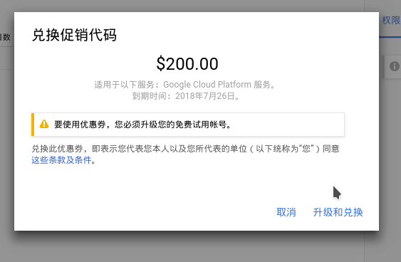
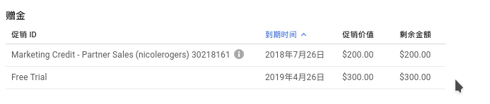
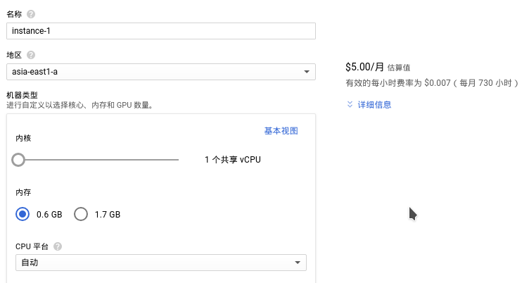

谷歌在两个月前便与Gitlab合作推出了一项旨在推广Kubernetes的优惠活动, 不过必须是Google Cloud的新用户才能申请. 首先注册Gitlab, 已经有账号就直接登录. 注册成功之后打开[优惠活动链接](https://about.gitlab.com/google-cloud-platform/).

## 申请优惠

点击"Redeem $200"按钮跳转申请页面, 填写一些个人信息, 主要是解释你打算用Google Cloud做什么, 如实回答就好, 例如个人使用之类的. 由于是人工审核, 工作日里一般在48小时内收到回复.

审核通过会收到一封邮件, 里面有优惠码, 一个月内必须使用这个优惠码, 优惠码的优惠期限是三个月.



活动的200美元加上Google Cloud提供的新人优惠300美元一共500美元.



## 服务尝鲜

优惠到手, 新建一个小鸡, 最低每个月5美元(不包括流量费用). 打开[VM实例](https://console.cloud.google.com/compute/)页面, 创建一个实例.



目前在大陆附近最快的谷歌云服务数据中心在台湾, 所以地区就选择图中的`asia-east`, 至于a, b, c就全凭个人喜好了, 反正都是台湾. 最低配置才5美元, 贵的是流量费用, 流向中国大陆的流量是$0.23/GB, 这是非常贵的价格了, 不过有优惠在, 个人用足够用一年的. 值得注意的是, 流量费用只算出站不算入站, 简单来说上传文件到服务器或者下载文件到服务器都是不花钱的, 只有从服务器下载文件才需要付费, 而且访问谷歌自家的服务是完全不收费的, 包括Youtube等网站, 不过要是流量传回中国可就是要收费的了.

## 初始化服务器

进入网页控制台, 编辑`/etc/ssh/sshd_config`允许`root`账号登录(看个人喜好). 然后在本地生成一对密钥, 把`id_rsa`放在`~/.ssh/`目录里面, 把`id_rsa.pub`上传到服务器的`/root/.ssh/`目录, 并追加到`authorized_keys`文件中.

```shell
ssh-keygen -t rsa -b 4096 -C "i@zuolan.me"
ssh-add ~/.ssh/id_rsa
scp id_rsa.pub root@233.233.233.233:/root/.ssh
cat id_rsa.pub >> authorized_keys
```

现在本地ssh客户端已经可以连接服务器了.

安装Docker:

```shell
$ dpkg-reconfigure locales
$ apt install docker.io
$ systemctl start docker && systemctl enable docker
$ docker --version
Docker version 17.12.1-ce, build 7390fc6
```

安装Zsh和Oh my zsh:

```shell
$ apt install zsh
$ sh -c "$(curl -fsSL https://raw.github.com/robbyrussell/oh-my-zsh/master/tools/install.sh)"

恢复Zsh配置(私人选项):

​```shell
$ git clone https://github.com/izuolan/dotfiles.git ~/.dotfiles
$ ln -sf ~/.dotfiles/config/zshrc .zshrc
```

恢复Tmux配置(私人选项):

```shell
$ git clone https://github.com/erikw/tmux-powerline.git ~/.tmux-powerline
$ rm -rf ~/.tmux
$ git clone https://github.com/izuolan/.tmux.git ~/.dotfiles/tmux
$ ln -sf ~/.dotfiles/tmux/powerline/mytheme.sh ~/.tmux-powerline/themes/mytheme.sh
$ ln -sf ~/.dotfiles/tmux/powerline/tmux-powerlinerc ~/.tmux-powerlinerc
$ ln -sf ~/.dotfiles/tmux ~/.tmux
$ ln -sf ~/.dotfiles/tmux/tmux.conf ~/.tmux.conf

恢复Tmux插件:

​```shell
$ mkdir -p ~/.dotfiles/tmux/plugins
$ vim ~/.tmux-powerline/themes/mytheme.sh
```

重新登录终端. 运行ShadowSocks:

```shell
$ docker run -d --name ss -p 2333:2333 mritd/shadowsocks -s "-s 0.0.0.0 -p 2333 -k password -m aes-256-cfb"
```

配置V2ray:

```json
# 配置文件
{
 "inbound": {
  "port": 9999,
  "protocol": "vmess",
  "settings": {
   "clients": [{ "id": "b831381d-6324-4d53-ad4f-自己修改" }]
  }
 },
 "outbound": {
  "protocol": "freedom",
  "settings": {}
 }
}
```

启动V2ray:

```shell
$ docker run -d --name v2ray -v ~/apps/v2ray:/etc/v2ray -p 9999:9999 v2ray/official v2ray -config=/etc/v2ray/config.json
```

完成.